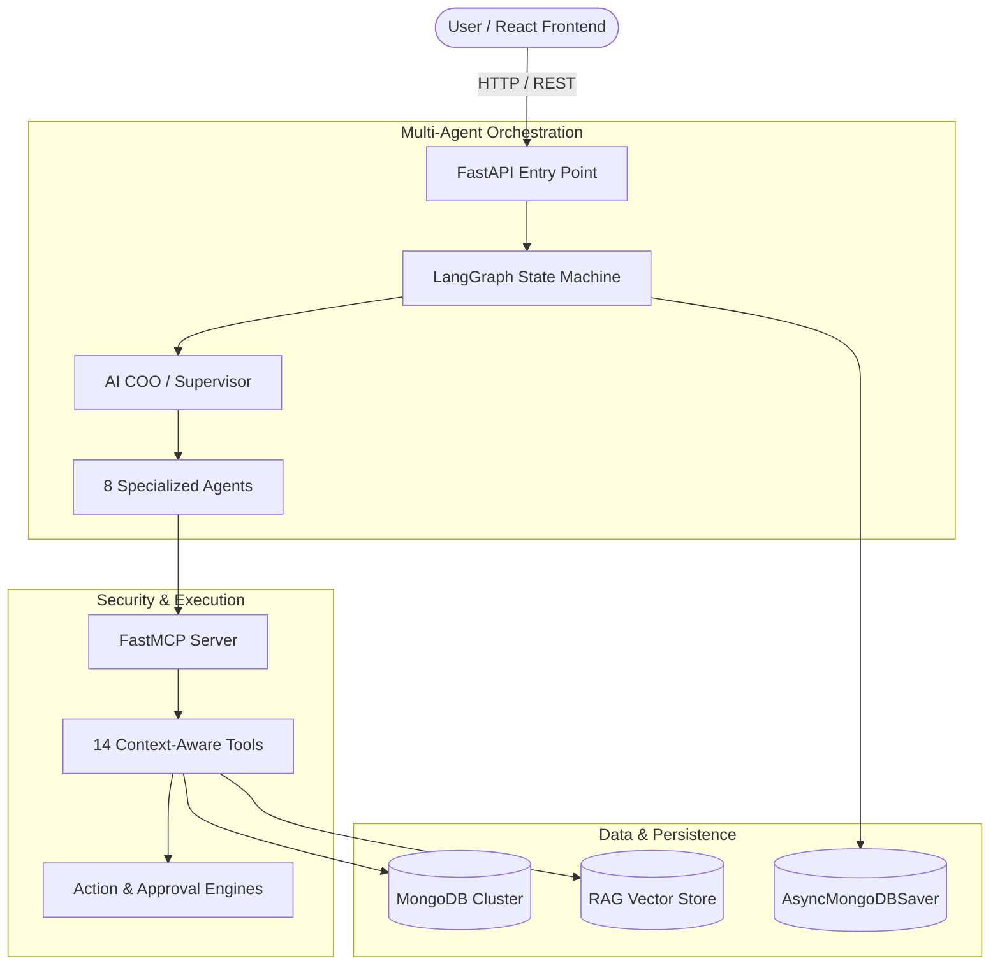

<div align="center">
  <h1>🏢 AI Operations Command Center</h1>
  <p><strong>An Industry-Grade AI Workforce Operating System for Startups</strong></p>

  
  
  
  
  
  
</div>

---

## 📖 Overview

The **AI Operations Command Center** is a multi-agent backend architecture that provides startups with a unified, autonomous workforce. It seamlessly manages Finance, Sales, HR, Customer Support, Operations, and Knowledge Retrieval without requiring a massive human operations team.

This system leverages **LangGraph** for deterministic multi-agent state orchestration and the **Model Context Protocol (MCP)** to execute secure, role-based tools across a MongoDB cluster.

---

## 📊 Key Metrics (Resume Ready)

- **`17` API Endpoints**: Scalable FastAPI architecture covering REST CRUD, Chat, Approvals, and Uploads.
- **`9` AI Agents**: 1 Supervisor/COO dynamically routing tasks to 8 specialized department models.
- **`14` MCP Tools**: Context-aware tools ranging from schema discovery to human-in-the-loop action triggers.
- **`11+` DB Collections**: Isolated multi-tenant architectures handling Customers, Invoices, Tasks, Checkpoints, etc.
- **`3` RAG Stages**: Fully integrated pipeline for Document Loading, Text Splitting, and Vector Embeddings.

---

## 🏗️ System Architecture

The architecture separates concerns into a clean REST API, a Stateful Agent Graph, and a secure Tool Execution layer.



---

## 🤖 The AI Workforce

| Agent | Responsibility | Core MCP Tools Used |
|---|---|---|
| **AI COO (Supervisor)** | Interprets intent, plans tasks, and routes to specialists. | *Routing Logic* |
| **Finance Agent** | Revenue, expenses, cash flow, budget monitoring. | `get_revenue_summary`, `get_overdue_invoices` |
| **Sales Agent** | Lead qualification, pipeline analysis, CRM management. | `get_sales_pipeline`, `search_customers` |
| **Support Agent** | Ticket resolution, escalations, complaint detection. | `search_support_tickets` |
| **Operations Agent** | Workflow bottlenecks, blocked tasks, SLA monitoring. | `get_blocked_tasks`, `get_operational_metrics` |
| **HR Agent** | Employee requests, onboarding/offboarding, compliance. | `lookup_employee`, `get_department_summary` |
| **Knowledge Agent** | Company policies, document retrieval (RAG). | `search_documents` |
| **Executive Agent** | Macro-level company health dashboards for founders. | *All Tools* |

---

## 📂 Project Structure

```text
company-ai-assistant/
├── app/
│   ├── main.py                 # Minimal FastAPI entry point & Router registration
│   ├── dependencies.py         # Global MongoDB & LangGraph Dependency Injection
│   ├── api/                    # RESTful Endpoints (Chats, Approvals, Resources)
│   ├── auth/                   # JWT Middleware & RBAC Security
│   ├── engines/                # Action & Approval Engines (Human-in-the-loop)
│   ├── graph/                  # LangGraph State Machine
│   │   ├── agents.py           # Specialized agent prompts & Personas
│   │   └── workflow.py         # Graph compilation & routing logic
│   ├── mcp/                    # Model Context Protocol
│   │   ├── server.py           # FastMCP Server definition
│   │   └── tools.py            # 14 Secure Tool implementations
│   ├── prompts/                # Modular prompt definitions
│   └── rag/                    # Retrieval-Augmented Generation pipeline
└── frontend/                   # React / TypeScript Application
```

---

## 🔄 Core Execution Workflows

### 1. Multi-Agent Reasoning Flow
When a user sends a message, it is validated via JWT and passed to `app.graph.workflow`. The **Supervisor Node** analyzes the request and routes it. The target **Worker Node** invokes the LLM with its specialized prompt, executes tools securely via MCP, and returns the response. Finally, `AsyncMongoDBSaver` persists the exact state graph to MongoDB for perfect conversational memory.

### 2. High-Stakes Action Flow (Human-in-the-Loop)
If an agent needs to perform an irreversible action (e.g., *Refund Customer*), it calls the `trigger_high_stakes_action` tool. The `ActionEngine` intercepts this, creates a `"PENDING"` record, and informs the user. A Human Manager can log into the dashboard and click "Approve", which triggers the `ApprovalEngine` to execute the logic and update the Audit Log.

### 3. Knowledge Retrieval (RAG) Flow
Admins upload PDFs via `POST /api/upload`. The backend extracts text, splits it into semantic chunks, generates vector embeddings, and stores them in MongoDB. The Knowledge Agent uses the `search_documents` tool to query this vector space using similarity search to answer complex policy questions.

---

## ⚙️ Setup & Configuration

### Prerequisites
- Python 3.11+
- Node.js 18+
- MongoDB instance (Local or Atlas)
- Google Gemini API Key

### 1. Environment Variables
Create a `.env` file in the root directory:
```env
MONGODB_URI=mongodb://localhost:27017
JWT_SECRET=your_super_secret_jwt_key
GOOGLE_API_KEY=your_gemini_api_key
```

### 2. Backend Setup
```bash
# Create and activate a virtual environment
python -m venv .venv
source .venv/bin/activate  # Windows: .\.venv\Scripts\activate

# Install dependencies
pip install -r requirements.txt

# Seed the database with mock company data
python scripts/seed_database.py

# Run the FastAPI server
uvicorn app.main:app --reload
```

### 3. Frontend Setup
```bash
cd frontend
npm install
npm run dev
```
