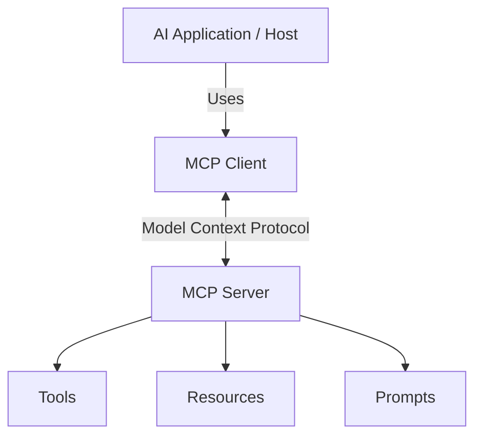

# MCP Architecture

To understand how the Model Context Protocol integrates into an application, you must understand its core architectural components.

## The Big Picture

## Core Components

### 1. The Host (AI Application)
The **Host** is the main application running the AI model. In our project, the FastAPI + LangGraph application is the Host. It manages the user interface, coordinates the LangGraph state machine, and communicates directly with Google Gemini.

### 2. The MCP Client
The **MCP Client** is a library integrated into the Host. It maintains the protocol connection to the MCP Server.
- It asks the server: "What tools do you have?"
- It converts the server's responses into a format the Host (or LangGraph) can understand.
- When the AI decides to use a tool, the Client forwards the execution request to the Server.

### 3. The MCP Server
The **MCP Server** is an independent process or service that exposes capabilities (Tools, Resources, Prompts). 
- It does **not** know anything about the AI model or the Host.
- It simply says: "I have a calculator tool that takes 'a' and 'b'. If you call it, I will return the sum."
- This separation allows the same MCP Server to be used by our LangGraph app, Claude Desktop, or any other MCP-compatible client.

## Transports (Communication Methods)

How do the Client and Server actually talk? MCP supports two main transports:

### 1. stdio (Standard Input/Output)
- The Client spawns the Server as a **local subprocess**.
- They communicate by writing JSON-RPC messages to standard input (`stdin`) and reading from standard output (`stdout`).
- **Best for**: Local tools, scripts, and tight integrations (this is what we use in our LangGraph integration!).

### 2. SSE (Server-Sent Events) over HTTP
- The Server runs as a standalone web service (like a FastAPI app).
- The Client connects via HTTP.
- **Best for**: Remote servers, scalable production environments, or multi-tenant architectures.
