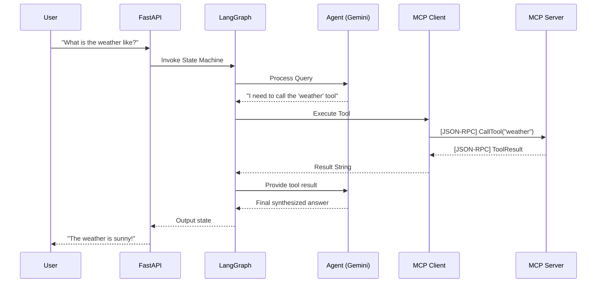

# LangGraph & MCP Integration

This document explains how our FastAPI + LangGraph AI agent communicates with our local MCP Server.

## The High-Level Flow



## How `langchain-mcp-adapters` Works

LangGraph expects tools to be instances of `BaseTool`. However, the MCP server returns a custom JSON schema describing its capabilities. 
To bridge this gap, we use the `langchain-mcp-adapters` package.

### Step 1: Connecting to the Server
We spawn the MCP server as a Python subprocess using `StdioServerParameters`.

```python
from mcp import StdioServerParameters
server_params = StdioServerParameters(
    command="python",
    args=["app/mcp/server.py"]
)
```

### Step 2: Translating Tools
Using `load_mcp_tools`, we fetch the MCP tools over the `stdio` connection and automatically convert them into LangChain `BaseTool` objects.

```python
from langchain_mcp_adapters.tools import load_mcp_tools

tools = await load_mcp_tools(session)
```

### Step 3: Binding to the Model
Once we have the translated tools, we bind them to our `ChatGoogleGenerativeAI` model just like standard native tools.

```python
model_with_tools = model.bind_tools(tools)
```

Now, when LangGraph executes the agent node, the model knows about the MCP capabilities and can request their execution natively!
